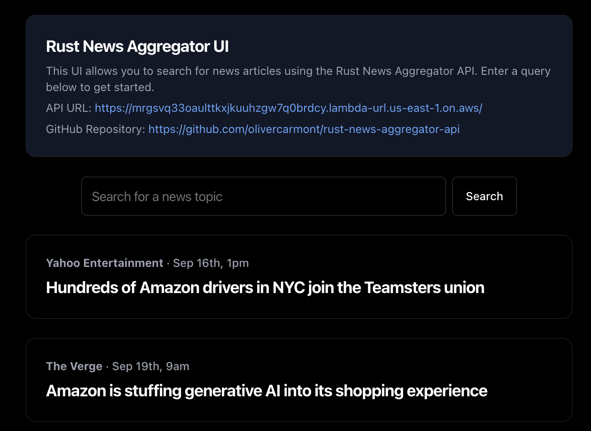

# Rust News Aggregator UI

This project provides a simple web interface for the Rust News Aggregator API. It allows users to search for news articles on various topics using a clean, minimalist design.

## Forks

1. Clone the repository
2. Install dependencies: `npm install`
3. Set up your environment variables:
   - Create a `.env.local` file in the root directory
   - Add your News API key: `NEWS_API_KEY=your_api_key_here`
4. Run the development server: `npm run dev`
5. Open [http://localhost:3000](http://localhost:3000) in your browser

## API Information

- API URL: [https://mrgsvq33oaulttkxjkuuhzgw7q0brdcy.lambda-url.us-east-1.on.aws/](https://mrgsvq33oaulttkxjkuuhzgw7q0brdcy.lambda-url.us-east-1.on.aws/)
- API GitHub Repository: [https://github.com/olivercarmont/rust-news-aggregator-api](https://github.com/olivercarmont/rust-news-aggregator-api)
